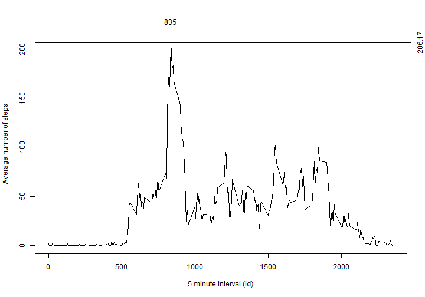
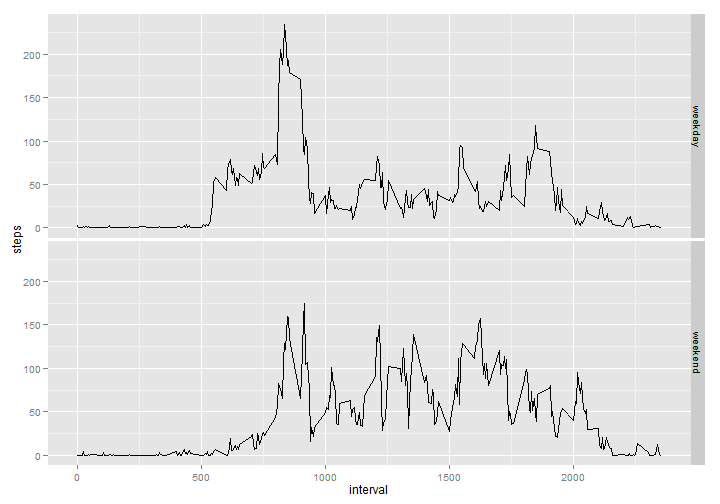

# Reproducible Research: Peer Assessment 1

## Loading and preprocessing the data
In order to load the data for this assignment, the file "activity.zip" must be
unziped and the resulting file "activity.csv" read. The data is cleaned by
removing records with NA values. The resulting dataset is saved 
on variable "activity". 


```r
unzip("activity.zip")
activity <- read.csv("activity.csv", header=TRUE)
activity <- activity[complete.cases(activity),]
```

## What is mean total number of steps taken per day?

The histogram for daily number of steps is created using the "tapply" function,
applying the "sum" function to the "steps" column of the dataset, on a per 
"date" basis.


```r
day.histogram <- data.frame(steps = tapply(activity$steps, activity$date, sum))
day.histogram$date <- rownames(day.histogram)
day.histogram <- day.histogram[complete.cases(day.histogram),]
summary(day.histogram)
```

```
##      steps           date          
##  Min.   :   41   Length:53         
##  1st Qu.: 8841   Class :character  
##  Median :10765   Mode  :character  
##  Mean   :10766                     
##  3rd Qu.:13294                     
##  Max.   :21194
```

As shown on the summary above, the **mean** of the total number of steps taken 
per day on the dataset is 
**10766**, while the 
**median** is **10765**.

## What is the average daily activity pattern?


```r
interval.means <- tapply(activity$steps, activity$interval, mean)
plot(x=rownames(interval.means), y=interval.means, type="l",
     xlab="5 minute interval (id)", ylab="Average number of steps")
maxSteps <- max(interval.means)
maxInterval <- as.numeric(names(interval.means[interval.means==maxSteps]))
abline(v=maxInterval)
axis(3, at=maxInterval, label=maxInterval)
abline(h=maxSteps)
axis(4, at=maxSteps, label=round(maxSteps, digits=2))
```

 

The graph shows the average daily activity pattern. The peak of activity
is reached on the **5 minute interval of the day** number **835**,
with an **average** of **206.17** **steps** (rounded to 
2 decimal places).

## Imputing missing values

Missing values in the dataset are filled in with the mean of the number of 
steps for the same interval. To help with that, function "fill.na" receives
a line of the dataset and returns either a valid number of steps or the mean of
the number of steps for that interval, calculated earlier.


```r
fill.na <- function(value, means) {
  if(is.na(value["steps"])) {
    as.numeric(means[as.character(as.numeric(value["interval"]))])
  } else {
    as.numeric(value["steps"])
  }
}

activity2 <- read.csv("activity.csv", header=TRUE)
na.number <- sum(is.na(activity2$steps))
activity2$steps <- apply(activity2, 1, fill.na, means=interval.means)
```

There is a total of **2304** NA values in the original dataset. The
new histogram of number of steps taken per day is calculated as earlier.


```r
day.histogram2 <- data.frame(steps = tapply(activity2$steps, activity2$date, sum))
day.histogram2$date <- rownames(day.histogram2)
summary(day.histogram2)
```

```
##      steps           date          
##  Min.   :   41   Length:61         
##  1st Qu.: 9819   Class :character  
##  Median :10766   Mode  :character  
##  Mean   :10766                     
##  3rd Qu.:12811                     
##  Max.   :21194
```

The **median** of the daily number of steps on the new dataset is 
**10766**, only 1 step 
more than the median calculated earlier. The **mean** calculated with the new
dataset is **10766**,
equal to the mean calculated earlier.

Hence, filling in the invalid number of steps on the original dataset with the
average number of steps for the corresponding time interval had minimal impact
on the **median** and **mean** of the daily number of steps.

## Are there differences in activity patterns between weekdays and weekends?

In order to identify differences in activity patterns between weekdays and
weekends, the dataset is extended with a column "day" indicating whether the
date corresponds to a "weekday" or "weekend". This column is added to the first
dataset used in this assignment (i.e. without the NA values).

A graphic similar to the previous on is created with two facets, one for the
average number of steps per interval for weekdays and another for weekends.


```r
Sys.setlocale("LC_TIME", "English")
```

```
## [1] "English_United States.1252"
```

```r
weekday <- c("Monday", "Tuesday", "Wednesday", "Thursday", "Friday")
weekend <- c("Saturday", "Sunday")

day <- function(date, weekday, weekend) {
    if(weekdays(as.Date(date)) %in% weekday) {
        factor(c("weekday", "weekend"))[1]
    } else {
        factor(c("weekday", "weekend"))[2]
    }
}

activity$day <- sapply(activity$date, day, weekday, weekend)

interval.day.means <- data.frame(tapply(activity$steps, 
                                        activity[,c("interval","day")], 
                                        mean))

interval.day.means <- rbind(data.frame(steps=interval.day.means$weekday, 
                                       day=factor(c("weekday", "weekend"))[1], 
                                       interval=as.numeric(rownames(interval.day.means))), 
                            data.frame(steps=interval.day.means$weekend, 
                                       day=factor(c("weekday", "weekend"))[2], 
                                       interval=as.numeric(rownames(interval.day.means))))

library(ggplot2)
qplot(data=interval.day.means, x=interval, y=steps, facets=day~., geom=c("line"))
```

 

It is possible to identify some differences between the activity on weekdays and
on weekends:

- On weekdays, the activity begins earlier than on weekends
- The activity level during weekends seems more evenly distributed than on
weekdays.
